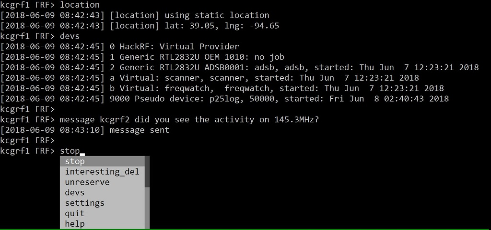
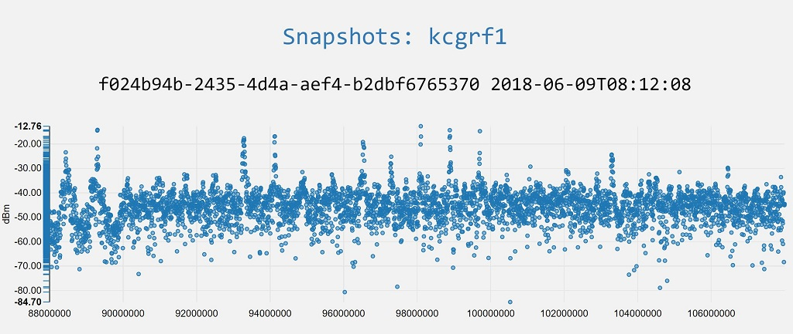
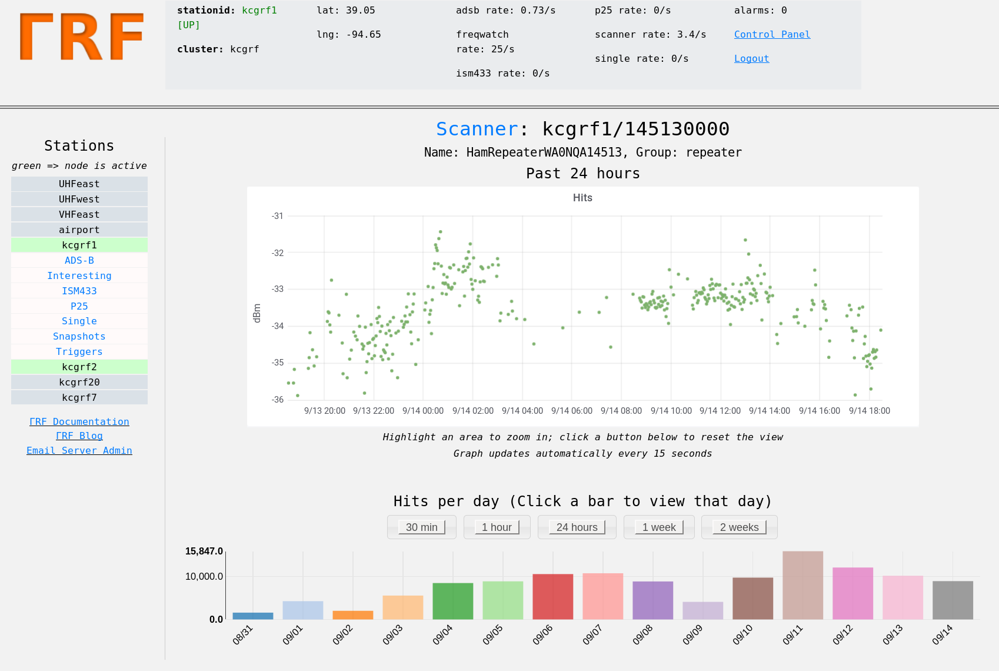
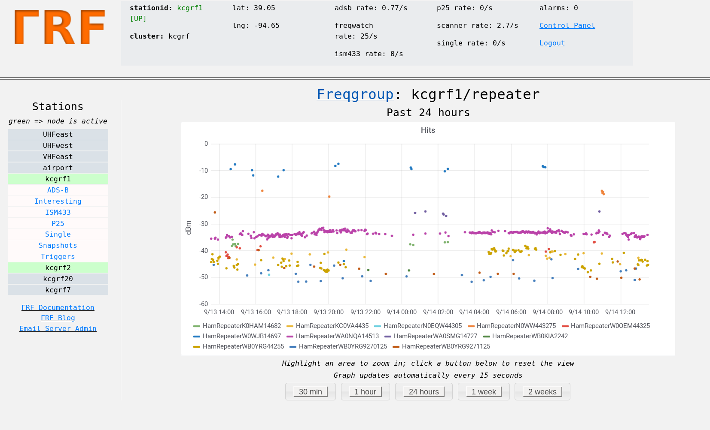

Distributed Radio Signal Collection and Analysis
================================================
ΓRF ("GammaRF", or "GRF") is a radio signal collection, storage, and analysis system based on inexpensive distributed nodes and a central server.  Put another way, it is a distributed system for aggregating information about signals, and a back-end infrastructure for processing this collected information into coherent "products".

Nodes utilize inexpensive hardware such as RTL-SDR and HackRF radios, and computers as small and inenexpensive as Intel NUCs.  Each node runs modules which provide various radio monitoring functionality, such as monitoring frequencies for "hits", watching power levels, keeping track of aircraft (through ADS-B), and more.  Nodes are distributed geographically and their data is combined on the server for hybrid analysis.

A web-based system allows users to view information from and about each station in its area.  Below shows the server landing page.  Markers are placed at each station's last known location (stations can be mobile or stationary.)

.. image:: _static/images/srv_landing.png
    :align: center

Status
======
The client and server are beta.  Please report any bugs to admin /at/ gammarf.io

Applications
============
Below are some examples of what can currently be done with the system.  Development is in early stages and many more capabilities are expected to emerge.

    * Monitoring ham radio activity on repeaters in a city
    * Creating timelines of emergency services activity in an area
    * Distributed tracking of satellites and other mobile emitters
    * Monitoring power at a frequency, for example as a mobile node traverses an area (e.g. signal source location)
    * Building direction finding networks (e.g. for fox hunts)
    * Spectrum enumeration (finding channels and guessing modulation) [under development]

Client
======
There is an open-source client available `here <https://github.com/gammarf/gammarf>`_.
The client interface is text-based, as shown in the below image.  We cover installation and usage of this client later in this documentation.

Server
======
The server collects, stores, and correlates data from clients, and provides an elegant web interface for analysis of its data.  In the first image below, we see a 'snapshot' of a frequency band (frequency vs. power), for station kcgrf1.  Below that we see the same station's activity log for one of its frequencies of interest, a ham radio repeater in this case.  The last image is a combined graph showing the station's log of hits for all repeater frequencies that it is monitoring.

ΓRF documentation
=====================

.. toctree::
   :maxdepth: 2

   client
   server
   protocol
   contact
