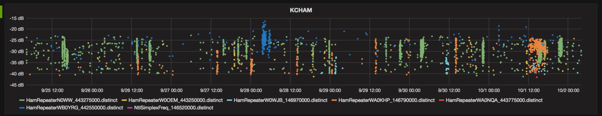
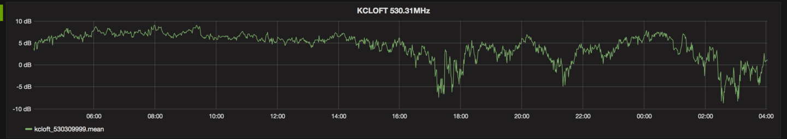
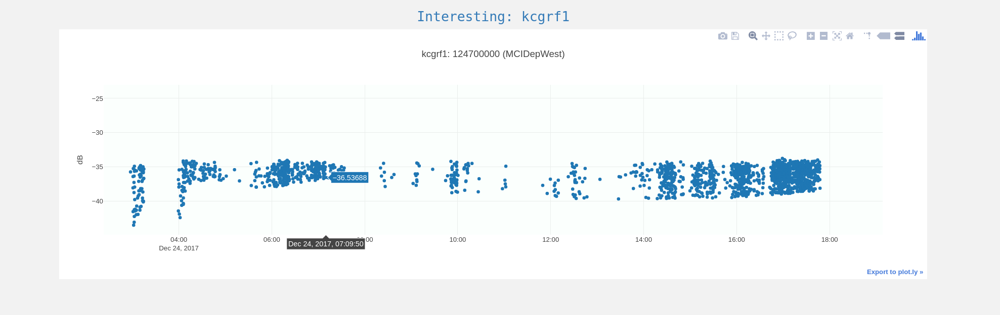
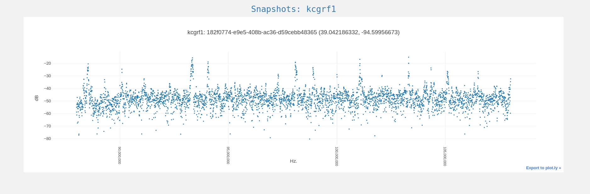

Distributed Radio Signal Collection and Analysis
================================================
ΓRF is a radio signal collection, storage, and analysis system based on
inexpensive distributed nodes and a central server.

Nodes run modules which provide various types of functionality,
such as monitoring specific frequencies, watching for activity on frequencies,
and monitoring aircraft in the area through their ADS-B traffic.  Nodes are
based on inexpensive hardware (such as the HackRF, Intel NUC, and RTL-SDR),
so the system is accessible to both professional and hobby users.

Data collected by nodes is stored on a server and combined into coherent
products.  These products are accessible through a web interface, in visually
appealing, easy-to-use form.

Applications
============
Some examples of what has been implemented, or may be easily implemented,
using the system include:

    * tracking satellites and other space objects
    * estimating the location of transmitters using TDOA
    * building direction finding networks (e.g. for fox hunts)
    * channel location and identification
    * creating timelines of activity on a radio channel

Client
======
There is an open-source client available `here <https://github.com/gammarf/gammarf>`_.
We cover installation and usage of this client later in this documentation.

.. figure:: _static/images/client.png
    :scale: 70 %

    ΓRF client software

Server
======
The server is composed of both open-source and proprietary software.

    Ham radio repeater activity.  Dense clusters of dots are conversations.  Graphed with `Grafana <https://grafana.com/>`_.

    Signal strength at a frequency, graphed over time.

.. figure:: _static/images/servermap.png
    :scale: 100 %

    A cluster of nodes are mapped, along with cluster reference transmitters.

    Each node has its own set of 'interesting frequencies' it can monitor.

    The 'snapshot' client module takes a picture of a swath of spectrum and sends it to the server.

ΓRF documentation
=====================

Contents:

.. toctree::
   :maxdepth: 2

   client
   server
   protocol
   contact
