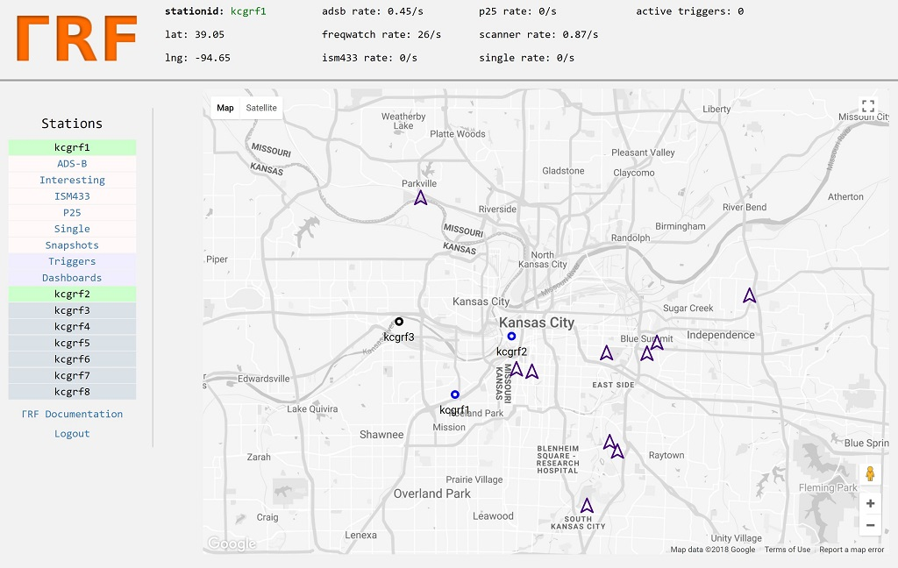

Distributed Radio Signal Collection and Analysis
================================================
ΓRF is a radio signal collection, storage, and analysis system based on
inexpensive distributed nodes and a central server.

Nodes run modules which provide various types of functionality,
such as monitoring specific frequencies, watching for activity on frequencies,
and monitoring aircraft in the area through their ADS-B traffic.  Nodes are
based on inexpensive hardware (such as the HackRF, Intel NUC, and RTL-SDR),
so the system is accessible to both professional and hobby users.

Data collected by nodes is stored on a server and combined into coherent
products.  These products are accessible through a web interface, in visually
appealing, easy-to-use form.

    Web interface, landing page

Applications
============
Some examples of what has been implemented, or may be easily implemented,
using the system include:

    * Monitoring ham radio activity on repeaters in a city
    * Distributed tracking of satellites
    * Building direction finding networks (e.g. for fox hunts)
    * Spectrum enumeration (finding channels and guessing modulation) [under development]
    * Creating timelines of emergency services activity in an area

Client
======
There is an open-source client available `here <https://github.com/gammarf/gammarf>`_.
We cover installation and usage of this client later in this documentation.

.. figure:: _static/images/client.jpg

    ΓRF client software

Server
======
The server collects and stores data from clients, and provides an elegant web interface for analysis of this data.

.. figure:: _static/images/srv_snapshot.jpg

    A 'snapshot' view of a spectrum slice as seen by a client

.. figure:: _static/images/srv_adsb_detail.jpg

    Timeline of ADS-B intercepts for a particular aircraft

ΓRF documentation
=====================

Contents:

.. toctree::
   :maxdepth: 2

   client
   server
   protocol
   contact
