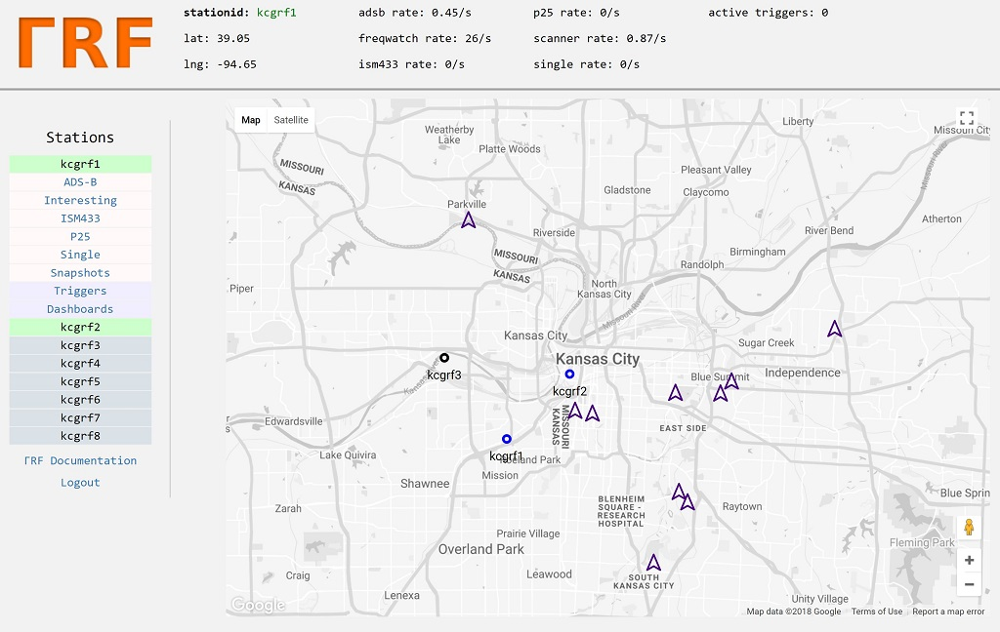
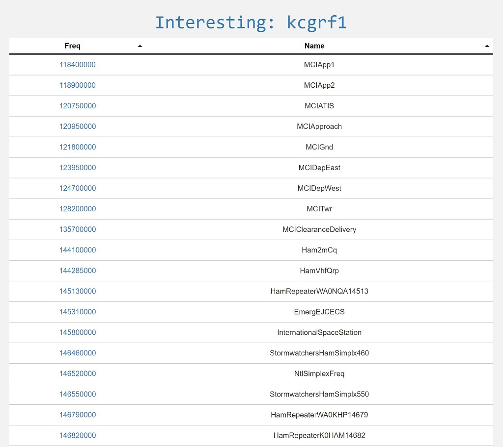
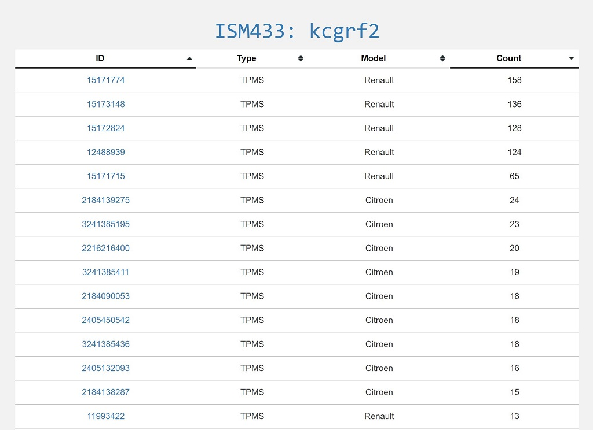
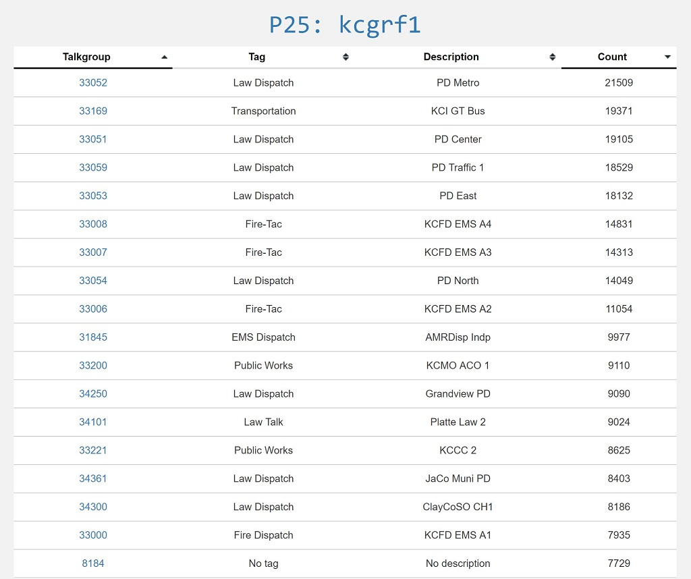
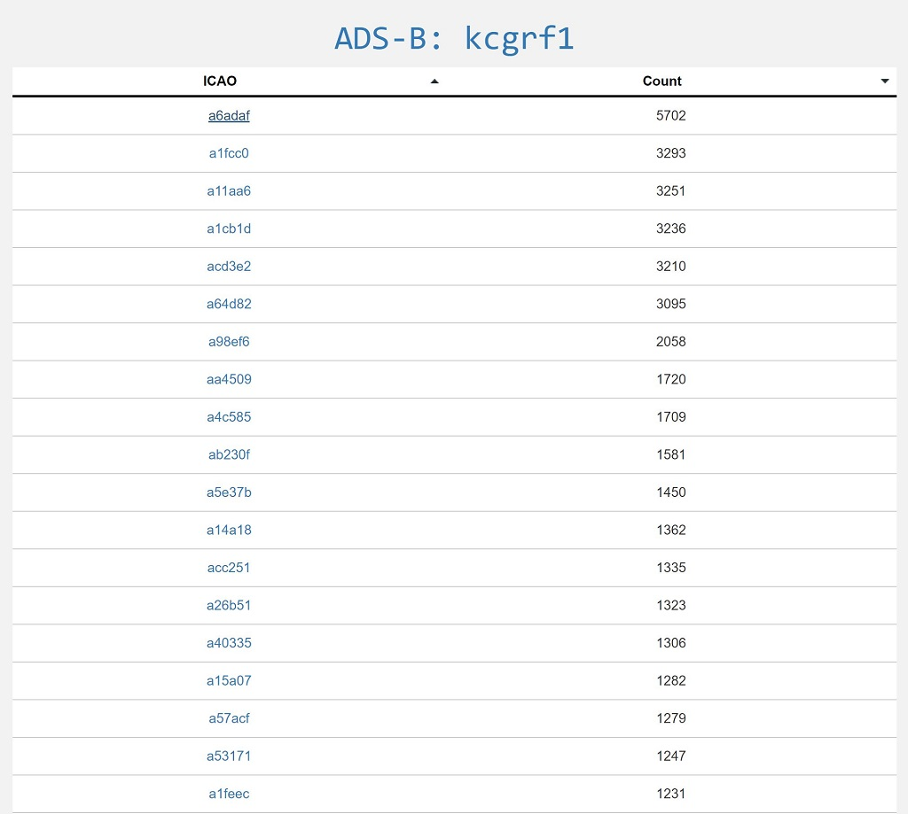
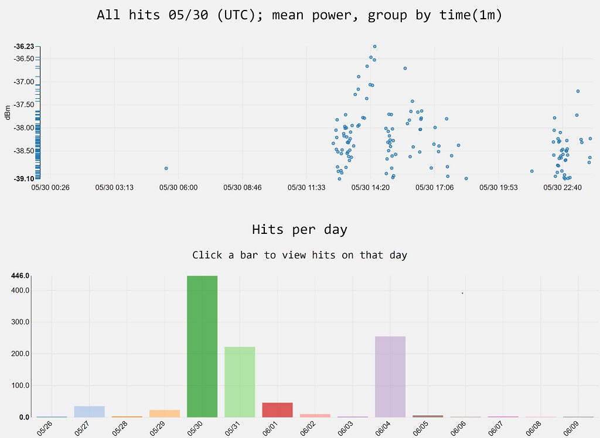
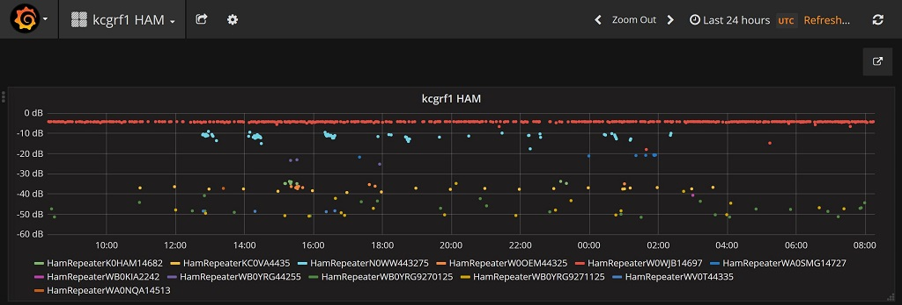
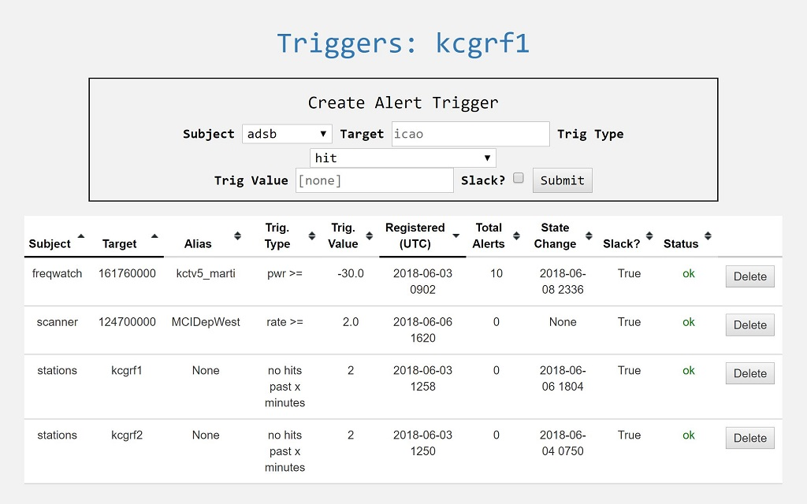

Server
******

This section covers basic server structure and usage from a consumer standpoint.  Server source is
not yet open.  However the server is free to use and anyone can create their own clusters.  One can
log into the kcgrf server (https://kcgrf.gammarf.io) with user and pass 'grfdemo' for a tour.

Organization
============

A server may host many *clusters*.  Clusters are groupings of stations.  There may be a different cluster per city, for example.

Clusters are composed of *stations*.  A station is identified by a *stationid* which is unique to both the cluster and the server.
Because a stationid is unique to the server, users in different clusters can message each other and request remotetasks from one
another across cluster boundaries.  All stations on a server will appear on the map, regardless of which cluster they are a part of.
So it makes sense that all stations in the same geographical area be a part of the same cluster.

Web Interface
=============

    Web interface, landing page

Server (web) accounts are linked to station accounts.  That is, each station has a corresponding logon on the server.

If you have not logged in to the server, upon visiting it you will see a logon page and a link to a self-explanitory sign-up page.
After you've signed up (using the cluster name provided by your friends, or creating your own), you will be directed to the
main page.  There you will see a map centered on the coordinates of the cluster you belong to.  On this map you will see markers for
stations in your cluster (if they've ever been online), and your cluster's reference transmitters.
Icons for stations will vary in color depending on their status (offline, online using static coordinates, online using GPS).

A menu on the left provides access to product pages for each station in the cluster.

Subject Pages
=============

There are pages for each subject (client module type), which list unique identifiers (such as frequency) that appear in the
server databases.  Below are a few examples.

Target Details
==============

A target (such as a frequency) has time series information stored in the server.  This information can be displayed and analyzed.

    Timeline of activity for a particular aircraft

Grafana
=======

`Grafana <https://grafana.com/>`_ is installed on the server and gives the user fine-grained access to the time series.

    Grafana representation of time series for ham radio frequencies

.. figure:: _static/images/grafana_air.jpg
    :align: center

    Grafana representation of time series for aircraft

Triggers
========

Using the triggers system, the user can be notified when certain conditions occur.  The following types of triggers are defined:

* hit: Any activity in a time series triggers an alert
* pwr >=: Power exceeding or equal to the trigger value will trigger an alert
* pwr <: Power less than the trigger value will trigger an alert
* rate >=: Activity in the time series at a rate greater than or equal to the trigger value will trigger an alert
* rate <: Activity at a rate less than the trigger value will trigger an alert
* no hits past 'x' minutes: No activity for the trigger value (as minutes) will trigger an alert.  Useful for monitoring station health (with the 'stations' subject)

When a trigger's conditions are met, it issues an alert.  This shows up on the triggers page, and can also be sent to a Slack channel.
