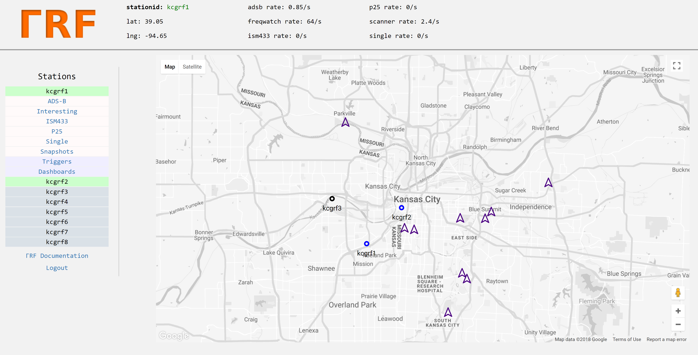
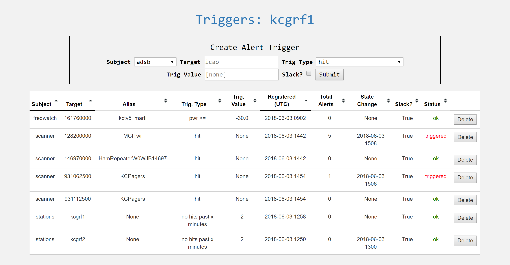

Server
******

Server source is not (yet) open.  This section covers basic server structure and usage from a consumer standpoint.

You can log into the demo server (https://gammarf.io:8080); user and pass are 'grfdemo'.

Organization
============

A server may host many *clusters*.  Clusters are groupings of stations.  There may be a different cluster per city, for example.

Clusters are composed of *stations*.  A station is identified by a *stationid* which is unique to both the cluster and the server.
Because a stationid is unique to the server (not just the cluster), users in different clusters can message each other, and request
remotetasks from one another, across cluster boundaries.

A server has an administrator that can add, delete, and edit clusters, stations, and other information for stations that utilize
that server.

Web Interface
=============

Server (web) accounts are not linked to station accounts.  While it may be convenient to have your stationid and your web login
and password the same, it's not strictly necessary.  This makes sense when you consider that a single user may host multiple
stations.

When you log in to the server, you will see a map with the cluster you belong to centered.  On this map you will see markers for
stations in your cluster, and your cluster's reference transmitters.  Icons for stations will vary in color depending on their
status (offline, online using static coordinates, online using GPS).

A menu on the left provides access to the different functions.  For now these include 'snapshot', 'interesting', and 'dashboards'.
The later are based on Grafana.

Triggers
========

The triggers system allows the user to define criteria on which an alert will be recorded and issued.  Triggers are sent to a slack
channel, as defined in the server configuration.

The following types of triggers are defined.  They are not all available for every subject:

* hit: Any activity in a time series triggers an alert
* pwr >=: Power exceeding or equal to the trigger value will trigger an alert
* pwr <: Power less than the trigger value will trigger an alert
* rate >=: Activity in the time series at a rate greater than or equal to the trigger value will trigger an alert
* rate <: Activity at a rate less than the trigger value will trigger an alert
* no hits past 'x' minutes: No activity for the trigger value (as minutes) will trigger an alert.  Useful for monitoring station health (with the 'stations' subject)
