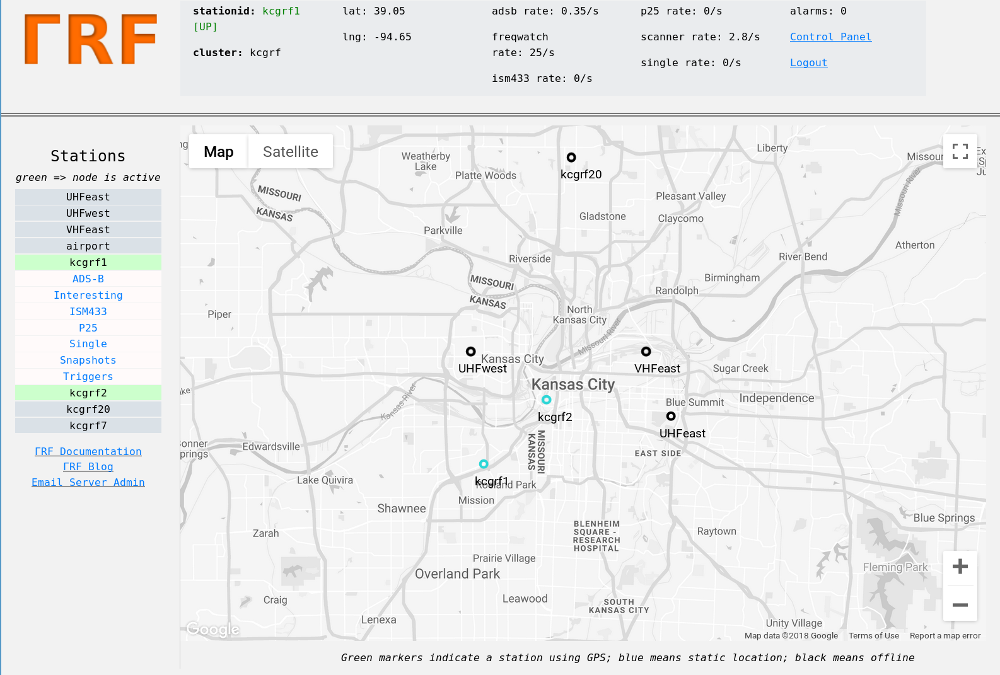
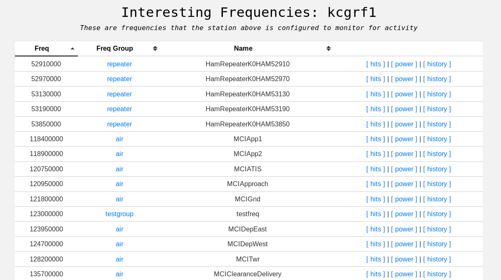
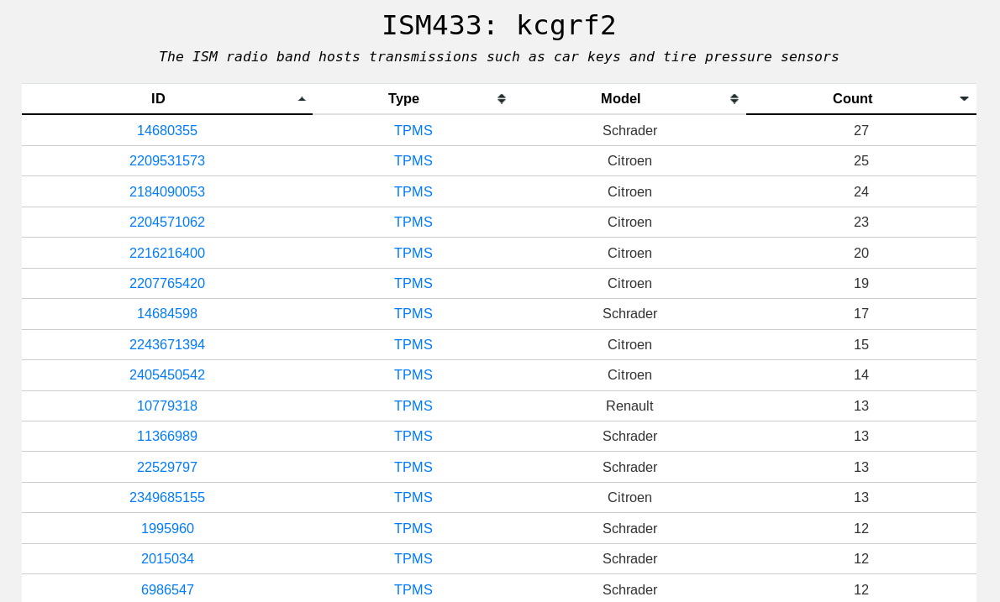
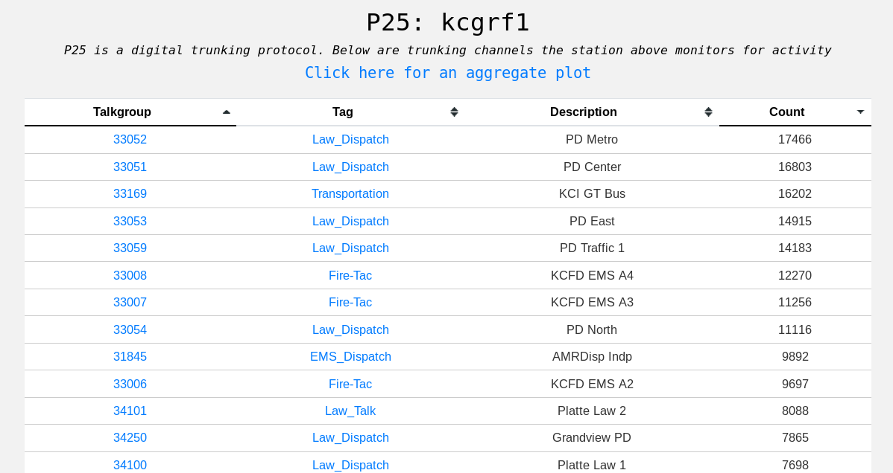
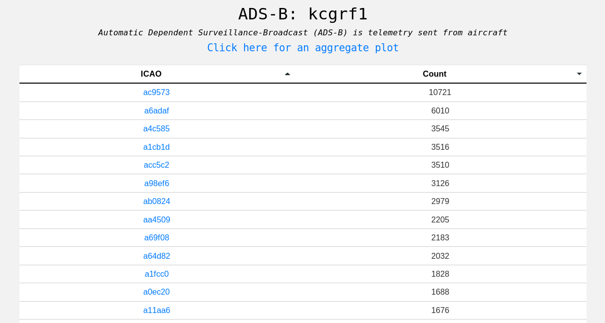
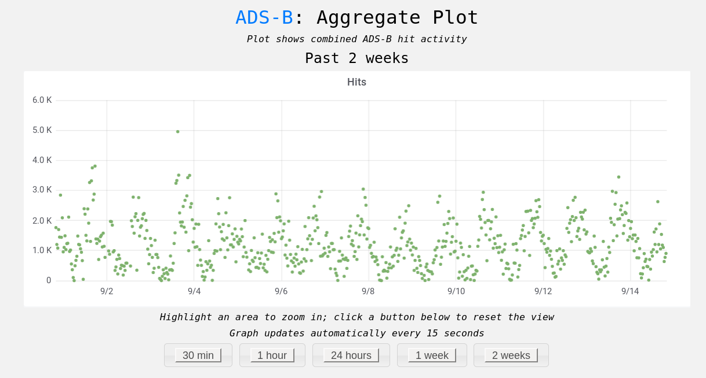

Server
******

~~This section covers basic server structure and usage from a user perspective.  The server is free to use and anyone can create their own clusters.  To access the server navigate to https://kcgrf.gammarf.io and create an account.  While creating an account, be sure to specify the same cluster name as other stations you want to work with.~~

The example server is no longer online.  Contact us for information about setting up a server for you.

Organization
============

A server hosts an arbitrary number of *clusters*.  Clusters are groupings of stations.  There may be a different cluster per city, for example.

Clusters are composed of one or more stations.  A station is identified by a *stationid* which is unique to both the cluster and the server.  Because a stationid is unique to the server, users in different clusters can message each other and request remotetasks from one another across cluster boundaries (using the GRF client).  All stations on a server will appear on the map, regardless of which cluster they are a part of.

Web Interface
=============

Server (web) accounts are linked to station accounts.  That is, each station has a corresponding logon on the server.

If you have not logged in to the server, upon visiting it you will see a logon page and a link to a self-explanitory sign-up page.
After you've signed up (using the cluster name provided by your friends, or creating your own), you will be directed to the
main page.  There you will see a map centered on the coordinates of the cluster you belong to.  On this map you will see markers for stations in your cluster (if they've ever been online), and your cluster's reference transmitters.  Icons for stations will vary in color depending on their status (offline, online using static coordinates, online using GPS).

A menu on the left provides access to product pages for each station in the cluster.

Subject Pages
=============

There are pages for each subject (client module type), which list unique identifiers (such as frequency) that appear in the
server databases.  Subject pages are where you access the information sent by the clients, and information derived from client measurements by the server.  Below are a few examples.

Target Details
==============

A target (such as a frequency) has time series information stored in the server.  This information can be displayed and analyzed.  Below you see a station's time-line of a ham radio repeater, followed by an aggregate aircraft (ADS-B) plot.

.. figure:: _static/images/srv_repeater.png
    :align: center
    :width: 70%

Triggers
========

Using the triggers system, the user can be notified when certain conditions occur.  The following types of triggers are defined:

* hit: Any activity in a time series triggers an alert
* pwr >=: Power exceeding or equal to the trigger value will trigger an alert
* pwr <: Power less than the trigger value will trigger an alert
* rate >=: Activity in the time series at a rate greater than or equal to the trigger value will trigger an alert
* rate <: Activity at a rate less than the trigger value will trigger an alert
* no hits past 'x' minutes: No activity for the trigger value (as minutes) will trigger an alert.  Useful for monitoring station health (with the 'stations' subject)

When a trigger's conditions are met, it issues an alert.  This shows up on the triggers page, and can also be sent to a Slack channel.
